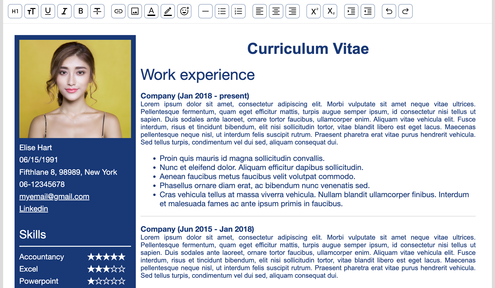

# vanilla-js-editor
A vanilla JS wysiwyg content editor, build for easy use and customisation. 
A working example can be found here: https://free-cv.bitstroom.com


## Get started
Download the latest release here: https://github.com/redsd/vanilla-js-editor/releases or clone this repo to your project.

Below you will find an example to get started
````
<head>
    <link rel="stylesheet" href="vanilla-js-editor/css/style.css">
    <!-- Optional to improve loadtime -->
    <link rel="modulepreload" href="vanilla-js-editor/editor.js">
    <link rel="modulepreload" href="vanilla-js-editor/helper.js">
    <link rel="modulepreload" href="vanilla-js-editor/imageHandler.js">
</head>
<body>
<!-- Toolbar -->

<div id="toolbar">
    <!-- All available buttons, class editor-btn-* is used to add function to the element-->
    <div class="button-group">
        <button title="Fontheader" class="editor-btn-headersize material-symbols-outlined">format_h1</button>
        <button title="Fontsize" class="editor-btn-fontsize material-symbols-outlined">format_size</button>
        <button title="Underline text" class="editor-btn-underline material-symbols-outlined">format_underlined</button>
        <button title="Cursive text" class="editor-btn-italic material-symbols-outlined">format_italic</button>
        <button title="Bold text" class="editor-btn-bold material-symbols-outlined">format_bold</button>
        <button title="Strikethrough text" class="editor-btn-strikethrough material-symbols-outlined">format_strikethrough</button>
    </div>
    <div class="button-group">
        <button title="Add link to text" class="editor-btn-link material-symbols-outlined">link</button>
        <input id="img-input" class="editor-btn-img tool-items" type="file" accept="image/*" id="file"
               style="display: none;">
        <button title="Add image" class="fa-solid  material-symbols-outlined" onclick="document.getElementById('img-input').click()">image</button>
        <button title="Change text color" class="editor-btn-color material-symbols-outlined">format_color_text</button>
        <button title="Change highlight color" class="editor-btn-highlightcolor material-symbols-outlined">border_color</button>
        <button title="add icon" class="editor-btn-icon material-symbols-outlined">add_reaction</button>
    </div>

    <div class="button-group">
        <button title="add line" class="editor-btn-hr material-symbols-outlined">horizontal_rule</button>
        <button title="Bullet list" class="editor-btn-unorderedlist material-symbols-outlined">format_list_bulleted</button>
        <button title="Numbered list" class="editor-btn-orderedlist material-symbols-outlined">format_list_numbered</button>
    </div>

    <div class="button-group">
        <button title="Align left" class="editor-btn-alignleft material-symbols-outlined">format_align_left</button>
        <button title="Align center" class="editor-btn-aligncenter material-symbols-outlined">format_align_center</button>
        <button title="Align right" class="editor-btn-alignright material-symbols-outlined">format_align_right</button>
    </div>

    <div class="button-group">
        <button title="Superscript" class="editor-btn-superscript material-symbols-outlined">superscript</button>
        <button title="Subscript" class="editor-btn-subscript material-symbols-outlined">subscript</button>
    </div>

    <div class="button-group">
        <button title="Indent" class="editor-btn-indent material-symbols-outlined">format_indent_increase</button>
        <button title="Outdent" class="editor-btn-outdent material-symbols-outlined">format_indent_decrease</button>
    </div>

    <div class="button-group">
        <button title="Undo last change" class="editor-btn-undo material-symbols-outlined">undo</button>
        <button title="Redo last change" class="editor-btn-redo material-symbols-outlined">Redo</button>
    </div>
</div>

<div style="width: 100%; min-height: 75vh; display: flex; align-items: stretch; flex-direction: row;">
    <div id="editor" style="flex: 1; margin: 10px; padding: 10px;">
        Edit your content here!
    </div>
    <textarea id="editor-source" style="flex: 1; margin: 10px;"></textarea>
    <div id="preview" style="flex: 1; margin: 10px;"></div>
</div>

<script type="module">
    import VanillaJSEditor from 'vanilla-js-editor/editor.js';
    const vanillaJSEditor = new VanillaJSEditor(['editor'], {
        image_max_width: 512,
        image_quality: 80,
        colors: VanillaJSEditor.getColors(),
        icons: VanillaJSEditor.getIcons()
    });
    vanillaJSEditor.setlinkEditorToElement('editor', 'editor-source', true);
    vanillaJSEditor.setlinkEditorToElement('editor', 'preview');
</script>
</body>
````

## Why
Vanilla JS Editor is build in pure javascript, to have zero depencies on other packages. It only relies on the browsers functionalities.
The code is meant to be easy to ride, adopt and adjust.
The editor is tested in Edge, Chrome (also Android), Firefox and Safari (also iOS, known bug selected text doesn't stay selected).


